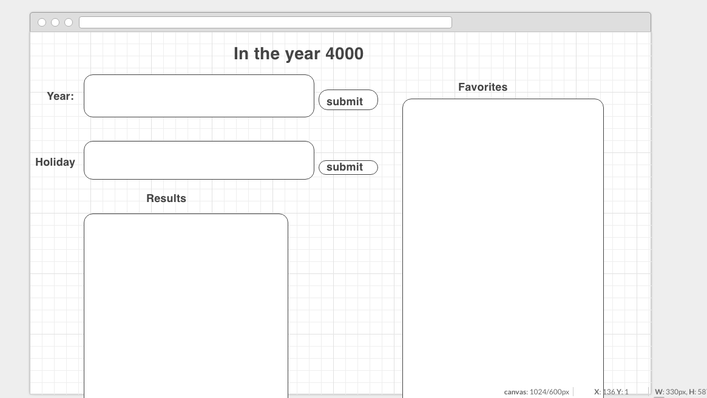
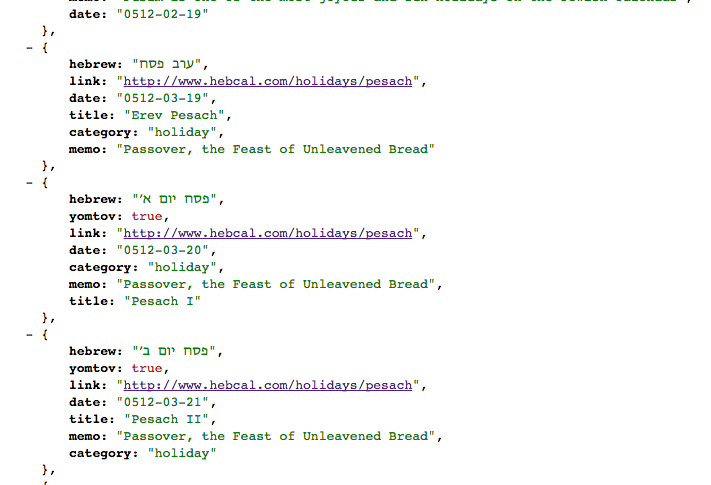
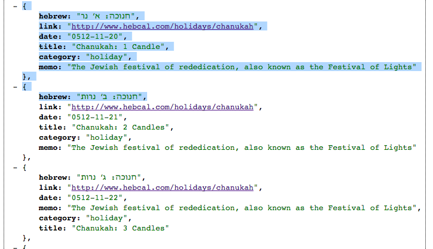
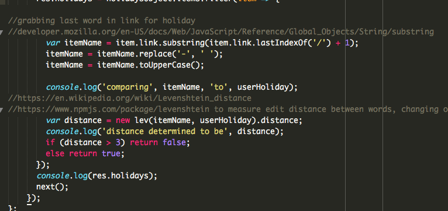

# Project2-- THE YEAR 4000

A Full Stack Web App

Introduction

The Jewish holidays have long been known to cause joy and confusion for many people. Fun with family, chicken soup, chopped liver, and alternate side parking suspensions for all. But they come at a different time every year due to the lunisolar calendar- a calendar that's based on lunar months...but solar years.

So confusing. But The Year 4000 puts all that to an end!!!

The Year 4000 is an app that allows the user to search the hebcal API for the Gregorian date of any Jewish holiday.  Users can create a profile and log in, after which they are brought to a search page where they:

-Enter a year

-Enter a holiday

...FOR ANY YEAR from the year 1 AD all the way through 9999 AD. Yup, the future.

Searches return all the days of a particular holiday, and can be saved and deleted as favorites in a separate column. Then they can click on the links of their favorites and learn more about the history and traditions behind these holy days.

------

Functionality

The application was built using node, express, mongo, javascript, css, and html.
The search feature involves some intricacies as the hebcal api database lists holidays with a problematic naming convention wherein holidays with multiple days (some as many as eight) have a different name.  

To account for this, as well the various different accepted spellings of many of the name of the holidays, several methods were employed in order to make the search more fuzzy and kid friendly.
As opposed to the title field, the link was parsed as key for the search, read using the lastIndexOf and substring methods, after which the strings were compared using a Levenshtein edit distance algorithm to match up different interpretations of spellings of the holidays.

References

www.hebcal.com
